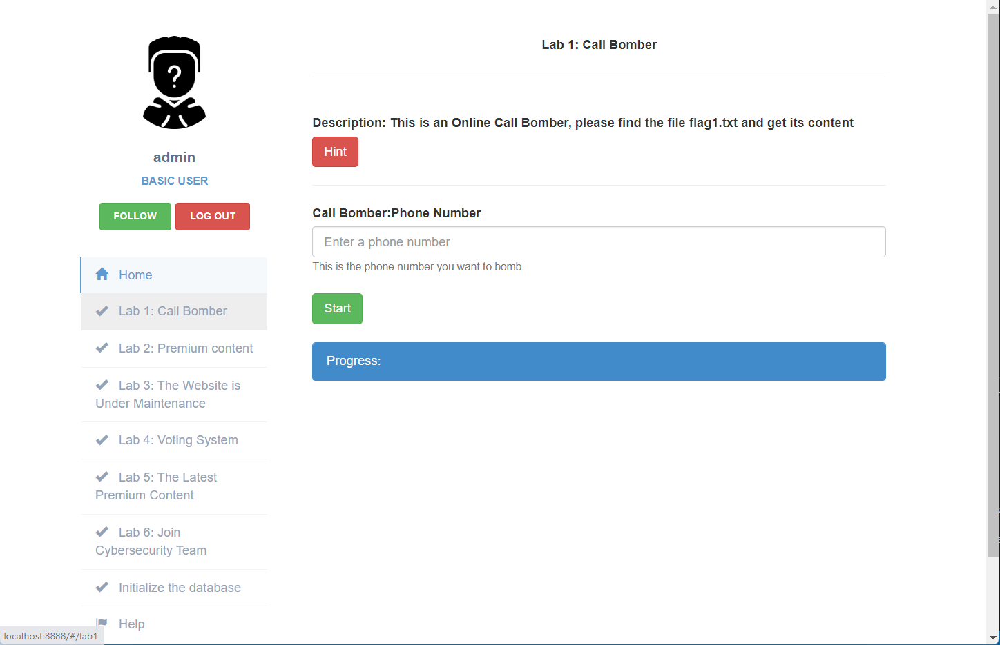
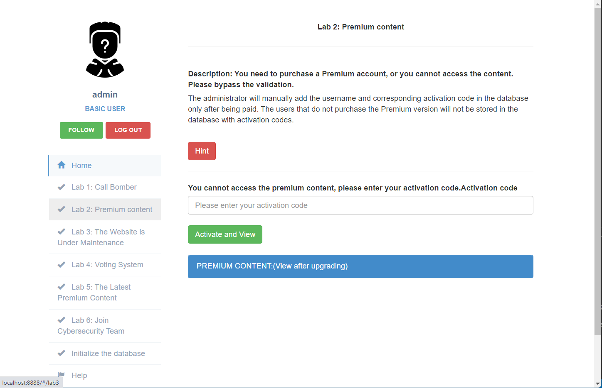
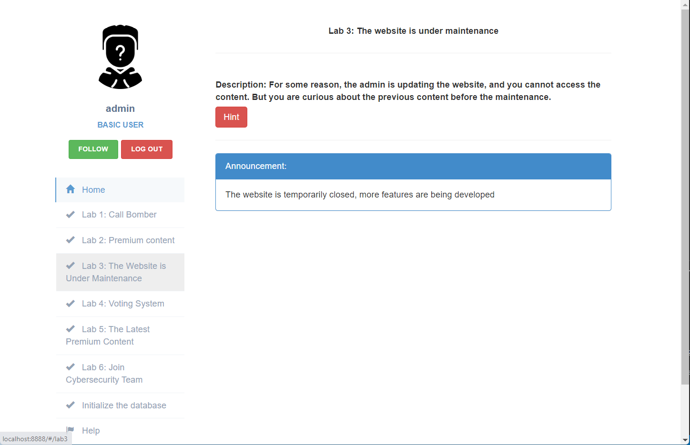
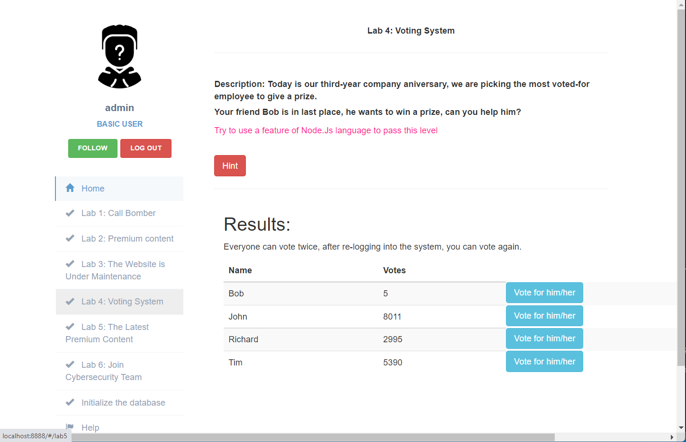
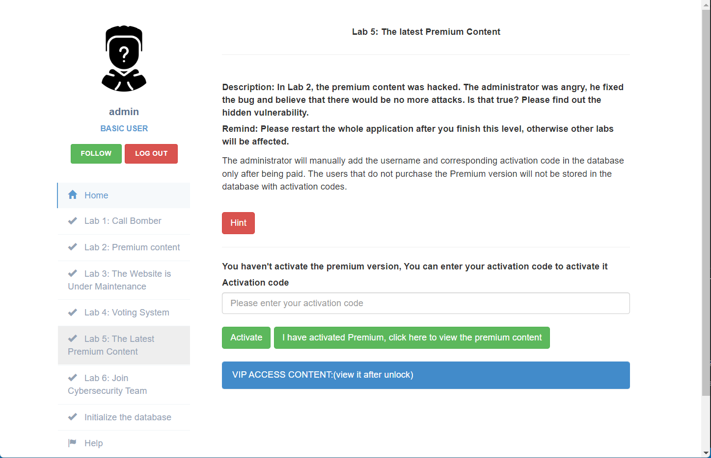
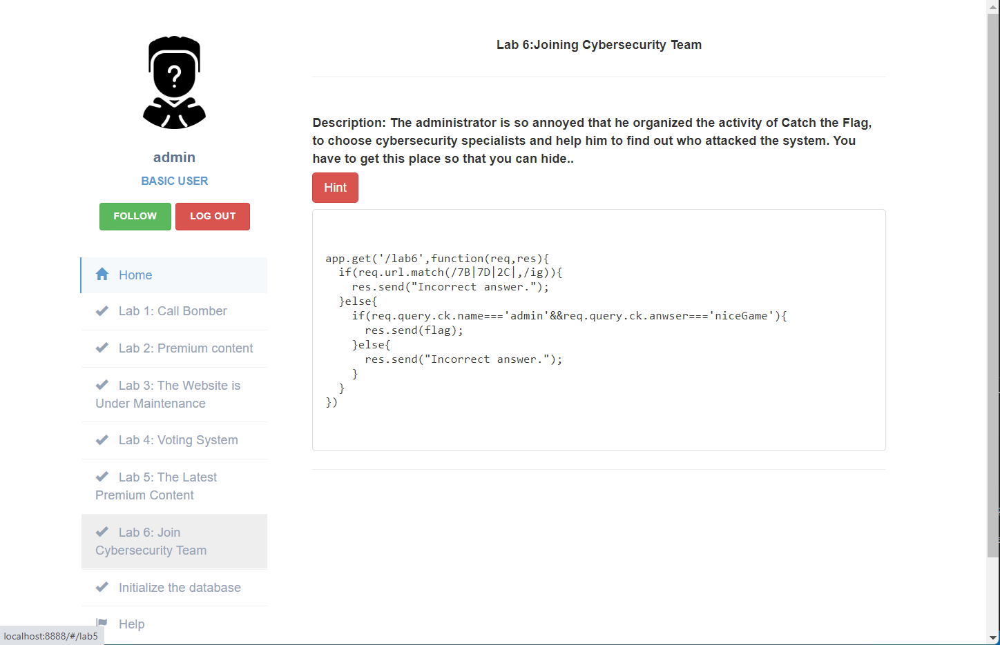
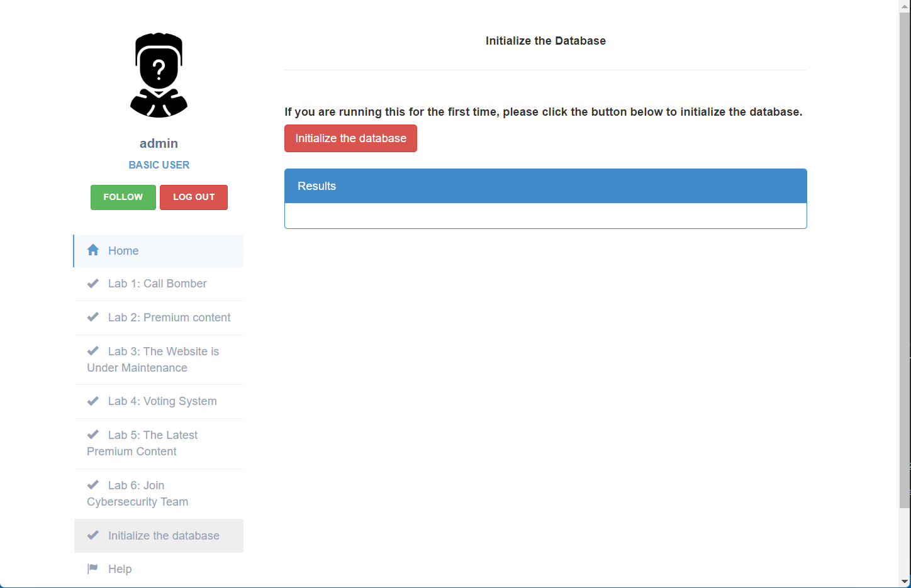

# Node.js vulnerability labs

**A vulnerable web application with defined vulnerabilities of Node.js.**

**This application is implemented by Node.js+Angular+Mongoose(Mongodb)**

## Screenshots

**There are currently 6 labs, previews are shown below**

 **Lab1**

 **Lab2**

**Lab3**

**Lab4**

**Lab5**

**Lab6**

## Install&Usage

### Method 1：Docker

**Installation**

`cd nodejs-vul-labs-main`

`docker-compose up`

**Run**

Access the labs: http://localhost:8888

### Method 2：Local Installation

**Required Environment**

[Node.js](https://nodejs.org/en/download/)

`npm install -g @angular/cli`

[mongoDB](https://docs.mongodb.com/manual/administration/install-community/)

**Installation**

`cd nodejs-vul-labs-main`

Download dependencies: `npm i`

Generate UI:`ng build` 

**Usage：**

First you need to launch mongoDB(`mongodb://localhost:27017`)

`node main.js`

Access the labs: http://localhost:8888

## Initialize the database

If you are running this application for the first time, please first initialize the database.

## Summary

| Lab Name                                | Vulnerability                            |
| --------------------------------------- | ---------------------------------------- |
| Lab 1：Call Bomber                      | Command Injection                        |
| Lab 2：Premium Content                  | NoSql injection                          |
| Lab 3：The Website is Under Maintenance | JavaScript feature                       |
| Lab 4：Voting System                    | JavaScript feature                       |
| Lab 5：The Latest Premium Content       | JavaScript prototype pollution           |
| Lab 6：Join Cybersecurity Team          | HTTP parameter pollution+Node.js feature |
