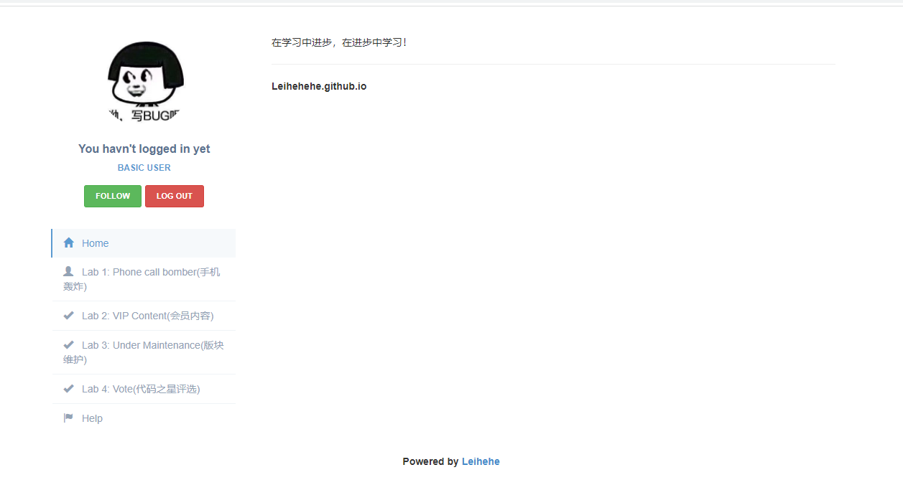
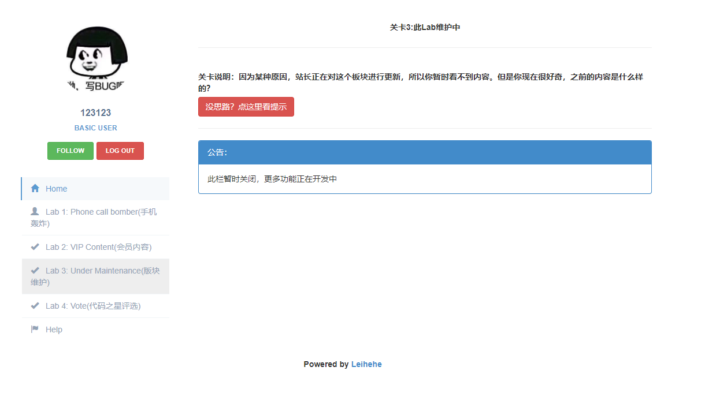

# NodejsLabs

**这是一个非常基础的Node.js的web渗透靶场，主要的Lab内容都是帮助大家入门和了解Node.js的一些特性和相关漏洞的产生原理。该靶场使用Node.js+Angular，以前后端分离模式搭建。写的很烂请见谅。**

## Screenshot

**下面是一些演示界面：**

**Home/Overview**

 **Lab1**

**Lab2**

## Install & use

**根目录下安装相关依赖：**

`npm i`

`ng build` 

[下载安装mongoDB](https://docs.mongodb.com/manual/administration/install-community/)

**使用：**

启动mongoDB(默认为`mongodb://localhost:27017`)

`node main.js`

访问：http://localhost:8888

## To Do

**因为作者也是边学习边编写，后续将逐渐添加新题。**

## Summary

| Lab名称             | 漏洞知识点           |
| ------------------- | -------------------- |
| Lab 1：手机轰炸     | 命令执行             |
| Lab 2：会员内容     | JavaScript原型链污染 |
| Lab 3：此Lab维护中  | JavaScript特性绕过   |
| Lab 4：代码之星评选 | JavaScript特性绕过   |

**待续。**

